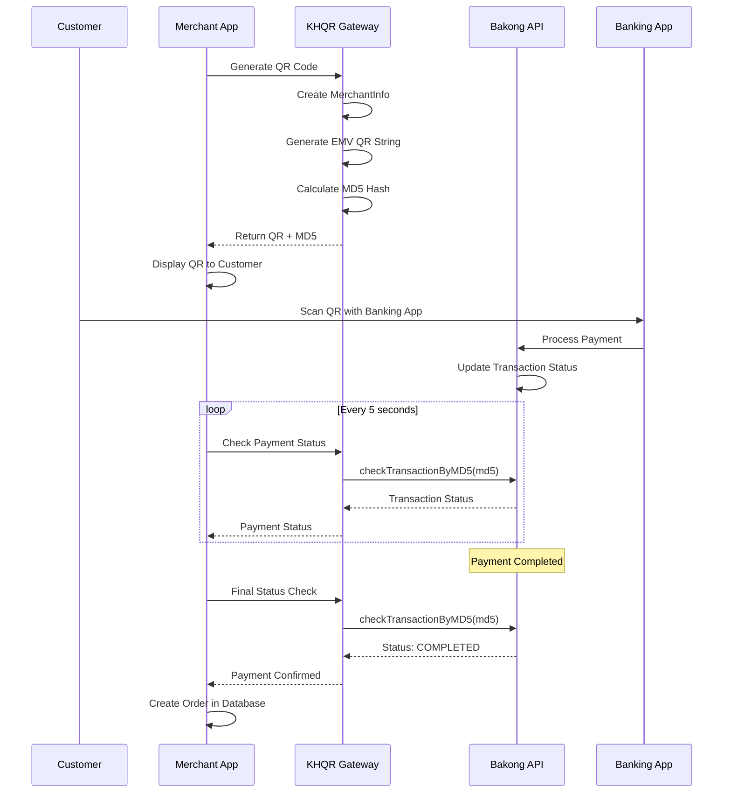

# Bakong Payment Process - Complete Technical Documentation

## Overview

This document provides a comprehensive technical overview of the Bakong payment process using the KHQR (Khmer QR) gateway. The process involves generating QR codes, transaction verification, and payment confirmation through Cambodia's National Bank (NBC) Bakong system.

## Table of Contents

1. [Architecture Overview](#architecture-overview)
2. [Key Components](#key-components)
3. [Payment Flow](#payment-flow)
4. [Core Files and Classes](#core-files-and-classes)
5. [API Endpoints](#api-endpoints)
6. [QR Code Generation](#qr-code-generation)
7. [Transaction Verification](#transaction-verification)
8. [Implementation Examples](#implementation-examples)
9. [Error Handling](#error-handling)
10. [Security Considerations](#security-considerations)

## Architecture Overview

The Bakong payment system uses QR codes based on the EMV (Europay, Mastercard, Visa) standard with Cambodia-specific extensions. The process involves:

```
Merchant System → KHQR Gateway → Bakong API → Mobile Banking Apps → Payment Confirmation
```

### Key Participants
- **Merchant**: Your application/website
- **KHQR Gateway**: Local library for QR generation and API communication
- **Bakong API**: NBC's official payment gateway
- **Customer**: Uses Bakong-compatible mobile banking app

## Key Components

### 1. Main Classes

#### `BakongKHQR` (Main Entry Point)
**File**: `backend/khqr-gateway/src/BakongKHQR.php`

The primary class that provides all functionality:
- QR code generation for merchants and individuals
- Transaction verification by various methods
- Account validation
- Token management

#### `MerchantInfo` (Merchant Data Model)
**File**: `backend/khqr-gateway/src/Models/MerchantInfo.php`

Contains all merchant information required for QR generation:
```php
// Required fields
- bakongAccountID: string    // Merchant's Bakong account (e.g., "merchant@bank")
- merchantName: string       // Display name
- merchantCity: string       // City location
- merchantID: string         // Unique merchant identifier
- acquiringBank: string      // Bank name

// Optional fields
- currency: int              // KHQRData::CURRENCY_USD or CURRENCY_KHR
- amount: float              // Transaction amount (0 for static QR)
- billNumber: string         // Invoice/bill reference
- storeLabel: string         // Store identifier
- mobileNumber: string       // Contact number
```

#### `Transaction` (Payment Verification)
**File**: `backend/khqr-gateway/src/Api/Transaction.php`

Handles all transaction verification methods:
- `checkTransactionByMD5()` - Most commonly used
- `checkTransactionByFullHash()`
- `checkTransactionByShortHash()`
- `checkTransactionByInstructionReference()`
- `checkTransactionByExternalReference()`

### 2. Configuration and Constants

#### `Constants` (API Endpoints)
**File**: `backend/khqr-gateway/src/Config/Constants.php`

Defines all Bakong API endpoints:
```php
// Production URLs
const BAKONG_API_BASE_URL = 'https://api-bakong.nbc.gov.kh';
const CHECK_TRANSACTION_MD5_URL = '/v1/check_transaction_by_md5';
const RENEW_TOKEN_URL = '/v1/renew_token';

// Testing URLs  
const BAKONG_API_SIT_BASE_URL = 'https://sit-api-bakong.nbc.gov.kh';
```

#### `KHQRData` (Data Constants)
**File**: `backend/khqr-gateway/src/Helpers/KHQRData.php`

Contains currency codes, merchant types, and EMV tag definitions:
```php
const CURRENCY_KHR = 116;  // Cambodian Riel
const CURRENCY_USD = 840;  // US Dollar
const MERCHANT_TYPE_INDIVIDUAL = 'individual';
const MERCHANT_TYPE_MERCHANT = 'merchant';
```

### 3. Utility Classes

#### `Utils` (Helper Functions)
**File**: `backend/khqr-gateway/src/Helpers/Utils.php`

Core utility functions:
- `post_data_to_url()` - HTTP API communication
- `crc16()` - CRC checksum calculation for QR validation
- `cutString()` - EMV tag parsing
- `checkCRCRegExp()` - QR code validation

## Payment Flow

### Complete Payment Process



### Step-by-Step Process

#### 1. QR Code Generation
```php
// Create merchant information
$merchantInfo = new MerchantInfo(
    bakongAccountID: 'merchant@ababank',
    merchantName: 'My Bookstore',
    merchantCity: 'Phnom Penh',
    merchantID: 'STORE001',
    acquiringBank: 'ABA Bank',
    currency: KHQRData::CURRENCY_USD,
    amount: 25.99,
    billNumber: 'INV-001'
);

// Generate QR code
$result = BakongKHQR::generateMerchant($merchantInfo);
$qrString = $result->data['qr'];      // EMV QR code string
$md5Hash = $result->data['md5'];      // MD5 for verification
```

#### 2. Customer Payment
- Customer scans QR with Bakong-compatible banking app
- App parses EMV data and shows payment details
- Customer confirms payment in banking app
- Bank processes transaction through Bakong network

#### 3. Payment Verification
```php
// Initialize with API token
$bakongKhqr = new BakongKHQR($apiToken);

// Check payment status using MD5 hash
$response = $bakongKhqr->checkTransactionByMD5($md5Hash);

if ($response['success'] && isset($response['transaction'])) {
    $transaction = $response['transaction'];
    if ($transaction['status'] === 'COMPLETED') {
        // Payment confirmed - create order
        $transactionId = $transaction['transactionId'];
        // Process successful payment...
    }
}
```

## Core Files and Classes

### 1. QR Code Generation Files

#### `BakongKHQR.php` - Main Generator
**Key Methods:**
- `generateMerchant(MerchantInfo $info)` - Generate merchant QR
- `generateIndividual(IndividualInfo $info)` - Generate individual QR
- `decode(string $qr)` - Decode existing QR
- `verify(string $qr)` - Validate QR checksum

#### `MerchantInfo.php` - Merchant Data
**Required Parameters:**
```php
public function __construct(
    string $bakongAccountID,    // e.g., "merchant@ababank"
    string $merchantName,       // e.g., "My Store"
    string $merchantCity,       // e.g., "Phnom Penh"
    string $merchantID,         // e.g., "STORE001"
    string $acquiringBank,      // e.g., "ABA Bank"
    // ... optional parameters
)
```

#### EMV Tag Models
Located in `backend/khqr-gateway/src/Models/`:
- `PayloadFormatIndicator.php` - EMV version
- `PointOfInitiationMethod.php` - Static vs Dynamic QR
- `TransactionAmount.php` - Payment amount
- `TransactionCurrency.php` - Currency code
- `MerchantName.php` - Merchant display name
- `CountryCode.php` - Country identifier (KH)
- `AdditionalData.php` - Bill number, store label, etc.

### 2. Transaction Verification Files

#### `Transaction.php` - API Communication
**Key Methods:**
```php
// Most commonly used - verify by MD5 hash
public static function checkTransactionByMD5(string $token, string $md5, bool $isTest = false)

// Alternative verification methods
public static function checkTransactionByFullHash(string $token, string $fullHash, bool $isTest = false)
public static function checkTransactionByShortHash(string $token, string $hash, float $amount, string $currency, bool $isTest = false)
public static function checkTransactionByInstructionReference(string $token, string $ref, bool $isTest = false)
```

#### `Utils.php` - HTTP Communication
**Key Method:**
```php
public static function post_data_to_url(string $url, array $payload, ?string $bearerToken = null): array
```
- Handles all HTTP communication with Bakong API
- Includes timeout and error handling
- Processes JSON responses

### 3. Helper and Utility Files

#### `KHQRData.php` - Constants and Definitions
- EMV tag definitions
- Currency codes
- Merchant type constants
- Validation rules

#### `EMV.php` - EMV Standard Constants
- Tag numbers for EMV fields
- Default values
- QR type definitions (static vs dynamic)

## API Endpoints

### Production Endpoints
Base URL: `https://api-bakong.nbc.gov.kh`

| Endpoint | Method | Purpose |
|----------|--------|---------|
| `/v1/check_transaction_by_md5` | POST | Verify payment by MD5 hash |
| `/v1/check_transaction_by_hash` | POST | Verify by full hash |
| `/v1/check_transaction_by_short_hash` | POST | Verify by short hash + amount |
| `/v1/check_transaction_by_instruction_ref` | POST | Verify by instruction reference |
| `/v1/check_transaction_by_external_ref` | POST | Verify by external reference |
| `/v1/renew_token` | POST | Renew API access token |
| `/v1/check_bakong_account` | POST | Validate Bakong account |
| `/v1/generate_deeplink_by_qr` | POST | Generate app deep links |

### Testing Endpoints
Base URL: `https://sit-api-bakong.nbc.gov.kh`
- Same endpoints with `SIT_` prefix in constants
- Use `$isTest = true` parameter in method calls

## QR Code Generation

### EMV QR Structure
The generated QR follows EMV standard with these key components:

```
Tag-Length-Value (TLV) Format:
00 02 01 01    - Payload Format Indicator (version 01)
01 02 11 01    - Point of Initiation Method (11=static, 12=dynamic)
29 XX ...      - Merchant Account Information (Individual)
30 XX ...      - Merchant Account Information (Merchant)
52 04 0000     - Merchant Category Code
53 03 840      - Currency (840=USD, 116=KHR)
54 XX ...      - Transaction Amount (if dynamic)
58 02 KH       - Country Code
59 XX ...      - Merchant Name
60 XX ...      - Merchant City
62 XX ...      - Additional Data
99 XX ...      - Timestamp
63 04 XXXX     - CRC Checksum
```

### Generation Process

#### 1. Create Merchant Information
```php
$merchantInfo = new MerchantInfo(
    bakongAccountID: 'store@ababank',
    merchantName: 'My Bookstore',
    merchantCity: 'Phnom Penh',
    merchantID: 'BOOK001',
    acquiringBank: 'ABA Bank',
    currency: KHQRData::CURRENCY_USD,
    amount: 15.50,
    billNumber: 'ORDER-12345'
);
```

#### 2. Generate QR Code
```php
$result = BakongKHQR::generateMerchant($merchantInfo);

// Result contains:
$qrString = $result->data['qr'];    // Full EMV QR string
$md5Hash = $result->data['md5'];    // MD5 hash for verification
```

#### 3. QR Types

**Static QR (amount = 0 or null):**
- Customer enters amount in banking app
- Reusable for multiple transactions
- Point of Initiation Method = 11

**Dynamic QR (amount > 0):**
- Fixed amount embedded in QR
- Single-use transaction
- Point of Initiation Method = 12

### Validation and Verification

#### CRC Validation
```php
// Verify QR code integrity
$isValid = BakongKHQR::verify($qrString);
if ($isValid->isValid) {
    // QR is valid and properly formatted
}
```

#### Decode QR Content
```php
// Decode QR to see embedded data
$decoded = BakongKHQR::decode($qrString);
$data = $decoded->data;
// Contains: merchantName, amount, currency, etc.
```

## Transaction Verification

### Primary Method: MD5 Verification

The most reliable method for payment verification:

```php
$bakongKhqr = new BakongKHQR($apiToken);
$response = $bakongKhqr->checkTransactionByMD5($md5Hash, $isTest);
```

#### Response Structure
```php
[
    'success' => true,
    'transaction' => [
        'transactionId' => 'TXN123456789',
        'status' => 'COMPLETED',           // PENDING, COMPLETED, FAILED
        'amount' => 15.50,
        'currency' => 'USD',
        'timestamp' => '2024-01-15T10:30:00Z',
        'senderAccount' => 'customer@bank',
        'receiverAccount' => 'merchant@bank',
        'reference' => 'ORDER-12345'
    ]
]
```

### Alternative Verification Methods

#### Full Hash Verification
```php
$response = $bakongKhqr->checkTransactionByFullHash($fullHash, $isTest);
```

#### Short Hash + Amount Verification
```php
$response = $bakongKhqr->checkTransactionByShortHash($shortHash, $amount, $currency, $isTest);
```

#### Reference-Based Verification
```php
// By instruction reference
$response = $bakongKhqr->checkTransactionByInstructionReference($reference, $isTest);

// By external reference
$response = $bakongKhqr->checkTransactionByExternalReference($externalRef, $isTest);
```

### Batch Verification
For multiple transactions:
```php
// Check multiple MD5 hashes at once
$md5Array = ['hash1', 'hash2', 'hash3'];
$response = $bakongKhqr->checkTransactionByMD5List($md5Array, $isTest);

// Check multiple full hashes
$hashArray = ['fullhash1', 'fullhash2'];
$response = $bakongKhqr->checkTransactionByFullHashList($hashArray, $isTest);
```

## Implementation Examples

### Complete Payment Integration

#### 1. Your BakongPaymentService
```php
class BakongPaymentService
{
    private $bakongKhqr;
    
    public function __construct()
    {
        $token = config('services.bakong.api_token');
        $this->bakongKhqr = new BakongKHQR($token);
    }
    
    public function generateQRCode($amount, $currency, $billNumber, $storeLabel)
    {
        try {
            $merchantInfo = new MerchantInfo(
                bakongAccountID: config('services.bakong.account_id'),
                merchantName: config('services.bakong.merchant_name'),
                merchantCity: config('services.bakong.merchant_city'),
                merchantID: config('services.bakong.merchant_id'),
                acquiringBank: config('services.bakong.acquiring_bank'),
                currency: $currency === 'USD' ? KHQRData::CURRENCY_USD : KHQRData::CURRENCY_KHR,
                amount: $amount,
                billNumber: $billNumber,
                storeLabel: $storeLabel
            );
            
            $result = BakongKHQR::generateMerchant($merchantInfo);
            
            return [
                'success' => true,
                'qr_string' => $result->data['qr'],
                'md5' => $result->data['md5'],
                'amount' => $amount,
                'currency' => $currency
            ];
            
        } catch (Exception $e) {
            return [
                'success' => false,
                'error' => $e->getMessage()
            ];
        }
    }
    
    public function checkTransactionByMD5($md5, $isTest = false)
    {
        try {
            return $this->bakongKhqr->checkTransactionByMD5($md5, $isTest);
        } catch (Exception $e) {
            return [
                'success' => false,
                'error' => $e->getMessage()
            ];
        }
    }
}
```

#### 2. Frontend Integration
```javascript
// Generate QR and start polling
async function processPayment(orderId) {
    // Generate QR code
    const qrResponse = await fetch('/api/bakong/generate-qr', {
        method: 'POST',
        body: JSON.stringify({ order_id: orderId }),
        headers: { 'Content-Type': 'application/json' }
    });
    
    const qrData = await qrResponse.json();
    
    if (qrData.success) {
        // Display QR code
        displayQRCode(qrData.data.qr_string);
        
        // Start polling for payment
        pollPaymentStatus(orderId);
    }
}

// Poll payment status every 5 seconds
function pollPaymentStatus(orderId) {
    const interval = setInterval(async () => {
        const response = await fetch(`/api/bakong/payment-status/${orderId}`);
        const data = await response.json();
        
        if (data.success && data.data.payment_status === 'completed') {
            clearInterval(interval);
            window.location.href = `/order-success?orderId=${orderId}`;
        }
    }, 5000);
}
```

### Sample Usage from Examples

#### Basic QR Generation
```php
// Individual QR
$individualInfo = new IndividualInfo(
    'john@bank',
    'John Smith',
    'Phnom Penh',
    KHQRData::CURRENCY_KHR,
    50000  // 50,000 KHR
);
$result = BakongKHQR::generateIndividual($individualInfo);

// Merchant QR
$merchantInfo = new MerchantInfo(
    'store@bank',
    'My Store',
    'Siem Reap',
    'STORE001',
    'ABA Bank',
    null,
    KHQRData::CURRENCY_USD,
    25.99,
    'INV-001'
);
$result = BakongKHQR::generateMerchant($merchantInfo);
```

#### Transaction Verification
```php
$bakongKhqr = new BakongKHQR($apiToken);

// Check by MD5 (most common)
$response = $bakongKhqr->checkTransactionByMD5('d60f3db96913029a2af979a1662c1e72', true);

// Check by full hash
$response = $bakongKhqr->checkTransactionByFullHash('dcd53430d3b3005d9cda36f1fe8dedc3714ccf18f886cf5d090d36fee67ef956', true);

// Check by short hash + amount
$response = $bakongKhqr->checkTransactionByShortHash('8465d722', 1.0, 'USD', true);
```

## Error Handling

### Common Exceptions

#### KHQRException Types
- `BAKONG_ACCOUNT_ID_REQUIRED` - Missing account ID
- `MERCHANT_NAME_REQUIRED` - Missing merchant name
- `MERCHANT_CITY_TAG_REQUIRED` - Missing city
- `MERCHANT_ID_REQUIRED` - Missing merchant ID
- `ACQUIRING_BANK_REQUIRED` - Missing bank name
- `TRANSACTION_AMOUNT_INVALID` - Invalid amount format
- `KHQR_INVALID` - Invalid QR code format
- `CONNECTION_TIMEOUT` - API timeout

#### Error Handling Pattern
```php
try {
    $result = BakongKHQR::generateMerchant($merchantInfo);
} catch (KHQRException $e) {
    Log::error('KHQR Error: ' . $e->getMessage());
    return response()->json([
        'success' => false,
        'error' => $e->getMessage()
    ], 400);
} catch (Exception $e) {
    Log::error('General Error: ' . $e->getMessage());
    return response()->json([
        'success' => false,
        'error' => 'Payment system error'
    ], 500);
}
```

### API Response Handling
```php
public function checkPaymentStatus($md5)
{
    try {
        $response = $this->bakongKhqr->checkTransactionByMD5($md5);
        
        if (!$response['success']) {
            return ['success' => false, 'message' => 'Transaction not found'];
        }
        
        if (!isset($response['transaction'])) {
            return ['success' => false, 'message' => 'Invalid response format'];
        }
        
        return [
            'success' => true,
            'transaction' => $response['transaction']
        ];
        
    } catch (KHQRException $e) {
        Log::error('Payment check failed: ' . $e->getMessage());
        return ['success' => false, 'error' => $e->getMessage()];
    }
}
```

## Security Considerations

### 1. API Token Management
- Store tokens securely in environment variables
- Implement token renewal before expiration
- Use different tokens for production and testing

```php
// Check token expiration
if (BakongKHQR::isExpiredToken($token)) {
    $renewResponse = BakongKHQR::renewToken($email, $isTest);
    // Update stored token
}
```

### 2. QR Code Security
- Validate QR codes before processing
- Implement CRC verification
- Check for proper EMV format

```php
$isValid = BakongKHQR::verify($qrString);
if (!$isValid->isValid) {
    throw new Exception('Invalid QR code');
}
```

### 3. Transaction Verification
- Always verify payments server-side
- Use MD5 hash verification as primary method
- Implement timeout for payment verification
- Log all transaction attempts

### 4. Network Security
- Use HTTPS for all API communications
- Implement proper timeout handling
- Validate all API responses
- Handle network failures gracefully

### 5. Data Validation
- Validate all merchant information
- Check amount formats and limits
- Verify currency codes
- Sanitize all input data

## Configuration Requirements

### Environment Variables
```env
# Bakong API Configuration
BAKONG_API_TOKEN=your_jwt_token_here
BAKONG_ACCOUNT_ID=merchant@bankname
BAKONG_MERCHANT_ID=MERCHANT001
BAKONG_MERCHANT_NAME=Your Store Name
BAKONG_MERCHANT_CITY=Phnom Penh
BAKONG_ACQUIRING_BANK=Bank Name
BAKONG_MOBILE_NUMBER=+855123456789

# Testing
BAKONG_USE_TESTING=false
```

### Required PHP Extensions
- `curl` - For API communication
- `json` - For data processing
- `mbstring` - For string handling

### Composer Dependencies
```json
{
    "require": {
        "php": "^8.0",
        "ext-curl": "*",
        "ext-json": "*"
    }
}
```

This documentation covers the complete Bakong payment process using the KHQR gateway. The system provides a robust, secure way to integrate Cambodia's national payment system into your application.